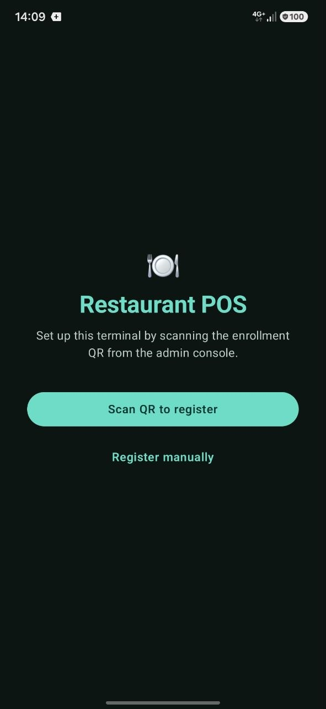
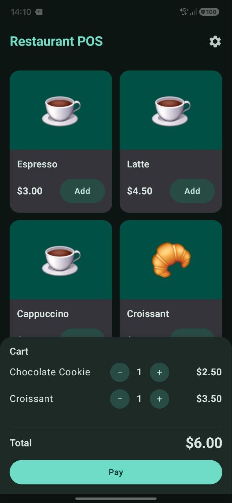
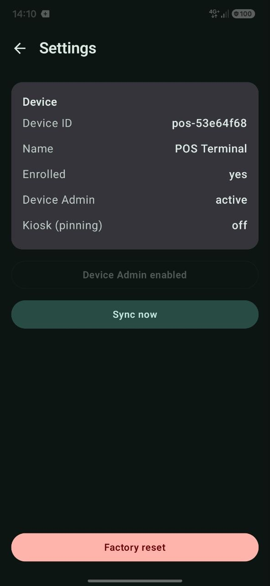
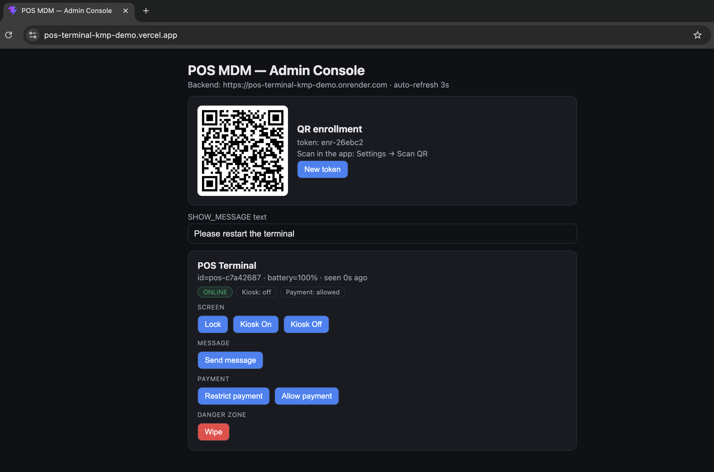

# Restaurant POS + MDM — Kotlin Multiplatform

[](https://github.com/VictorSkurchik/pos-terminal-kmp-demo/actions/workflows/ci.yml)
[](https://play.google.com/apps/internaltest/4701148156899935801)
[](https://pos-terminal-kmp-demo.vercel.app/)
[](https://pos-terminal-kmp-demo.onrender.com/devices)
[](https://kotlinlang.org)

**Live demo:** [Android app (Google Play — internal testing)](https://play.google.com/apps/internaltest/4701148156899935801) · [web admin](https://pos-terminal-kmp-demo.vercel.app/) · [backend API](https://pos-terminal-kmp-demo.onrender.com/devices)
— the Play link requires being added as a tester; the web/backend run on a free tier, so the first request may cold-start (~30–60 s).

Portfolio project: an Android **restaurant POS terminal** with a built-in **MDM agent**, plus a Ktor
backend and a web admin console for remote device management. Demonstrates Kotlin Multiplatform, Jetpack
Compose with a Material3 **atomic-design** component library, an **MVI** presentation layer, multi-module
**Clean Architecture**, Navigation Compose, Ktor, Room (KMP), Koin, WorkManager, a foreground service,
and Android Enterprise APIs (`DevicePolicyManager`, screen pinning).

## Screenshots

| Registration | POS | Settings | Offer (kiosk) |
|:---:|:---:|:---:|:---:|
|  |  |  |  |

Web admin console:



## What it does

- **POS** (Android, Compose): branded menu grid (2 columns, image/emoji cards) → cart → "payment" stub.
- **MDM agent**: the terminal registers with the backend and runs an always-on **foreground service**
  that heartbeats, polls the command queue and executes commands — it keeps working when the app is
  backgrounded (surfacing commands as a snackbar in-app, a notification otherwise). WorkManager is the
  periodic fallback.
- **Offer attract loop**: in kiosk mode, after 10 s of inactivity the terminal shows a full-screen
  promo screensaver (rotating offers with Instagram-stories progress bars); a tap returns to POS.
- **Backend** (Ktor + Room/SQLite): source of truth for devices and the command queue; REST API.
- **Web admin** (React + TypeScript, Vite): device list with live status badges, grouped command
  buttons, and a QR generator for enrollment.

The backend, the Android app and the **shared KMP `:core`** module reuse the same models, DTOs and Ktor
HTTP client. The web admin is a small separate TS app that mirrors the handful of DTO types.

## Screens & navigation

Navigation Compose (`org.jetbrains.androidx.navigation`, the Compose-Multiplatform build of Google's
Navigation Compose). The app owns the `NavHost`; feature modules expose stateless screens + callbacks.

```
Registration ──enroll (QR / manual)──▶ POS ──gear icon──▶ Settings
     ▲                                  │                    │
     └──────── Factory reset / Wipe ────┴────────────────────┘
                                        │
                    kiosk idle 10 s ──▶ Offer ──tap──▶ POS
```

Start destination is enrolment-driven: unenrolled → **Registration**, enrolled → **POS**.

## Module architecture

**Feature-owned vertical slices over a small shared kernel.** Each feature module contains its own
`domain / data / presentation` (with its own Koin module); core holds only what is genuinely shared.
Adding a feature = one self-contained module. Dependencies point **inwards only**.
See [docs/ARCHITECTURE.md](docs/ARCHITECTURE.md).

```
:core            KMP (android, jvm, js) — @Serializable wire DTOs + Device/Command wire models +
                 PosApi/KtorPosApiClient + posJson. Transport-only; shared by :server and :feature:mdm.
:core:domain     Pure Kotlin/JVM shared kernel — AppResult/DomainError, DispatcherProvider, Money,
                 and the cross-cutting DevicePolicy port. No feature domain, no Android/Ktor/Room.
:core:ui         Android library — generic Material3 design system (AppButton, ConfirmDialog,
                 StoryProgressBar, …) + theme + the MVI base. No domain dependency.
:server          Ktor (JVM) -> :core. Room + BundledSQLiteDriver (self-contained SQLite), REST API.
:feature:pos     Vertical slice — domain (Product/Cart, repos, use cases), data (Room cart store,
                 catalog, mappers), presentation (ViewModel + screen + POS-specific components).
:feature:mdm     Vertical slice — domain (Device/Command, DeviceRepository, MdmServices, use cases),
                 data (DeviceRepositoryImpl, enrollment settings, Ktor client, providers, device-admin,
                 WorkManager, foreground service, QR scanner), presentation (Registration + Settings).
:feature:offer   Presentation-only slice — full-screen Offer attract loop (stories-style).
:app:androidApp  Android app — Koin init, type-safe NavHost, AppViewModel (session/kiosk), the
                 DevicePolicy DataStore impl, flavors.
build-logic/     Gradle convention plugins (android.library/application/compose, quality).
web-admin/       React + TypeScript (Vite) — admin console. Not KMP; mirrors :core DTOs in TS.
```

Shared reuse points: wire DTOs / `PosApi` (`:core`, shared with `:server`); the kernel primitives and
the `DevicePolicy` port (`:core:domain`); one generic design system + MVI base (`:core:ui`); one Koin
DI style. Cross-cutting MDM policy flags (`restrictPayment`/`kioskActive`) flow through `DevicePolicy`
so `pos` and `mdm` stay fully independent (no feature→feature dependency).

## Tech stack

Kotlin 2.4, AGP 9 (built-in Kotlin), compileSdk 37, Compose Multiplatform 1.11 (Android) + type-safe
Navigation Compose 2.9, Ktor 3.5 (client + server), Room 2.8 (KMP), Koin 4.2, WorkManager, Coil 3,
kotlinx.serialization, Coroutines/Flow. Clean Architecture (domain use cases, `AppResult`/`DomainError`)
with an **MVI** presentation layer — a shared base in `:core:ui/mvi` (immutable `UiState` + `Intent` +
one-shot events). Web admin: React 19 + TypeScript + Vite; qrcode.react.

**Engineering:** Gradle convention plugins (`build-logic/`), a single-sourced JDK 17 toolchain
(catalog `jdk`), version-catalog BOMs (Ktor/Koin/Coil/coroutines), ktlint + detekt + Android Lint in CI,
unit tests (JUnit + coroutines-test + Turbine + Ktor MockEngine + Room-testing), Compose `@Preview`s.
Advisory skill reports live in [docs/skill-reports/](docs/skill-reports/). See
[docs/ARCHITECTURE.md](docs/ARCHITECTURE.md) and [CONTRIBUTING.md](CONTRIBUTING.md).

## Build variants

Three environments via a `env` flavor dimension; the base URL is a per-flavor `BuildConfig.SERVER_URL`
(overridden at runtime by the QR-scanned `serverUrl`). Version is `version.properties` (semver).

```bash
./gradlew :app:androidApp:assembleDevDebug       # dev — local backend (10.0.2.2:8080), cleartext
./gradlew :app:androidApp:assembleStagingDebug   # staging backend (HTTPS)
./gradlew :app:androidApp:assembleProdRelease     # prod (Render), minified (R8) + signed
```

## Running

Requires JDK 17+, Android SDK, an emulator/device.

### Everything with one command

```bash
./run.sh                # backend + web admin + Android (if a device is connected)
./run.sh --no-android   # backend + web only
```

Starts the backend (8080) and the web admin (Vite dev on 5173, pointed at the local backend via
`VITE_SERVER_URL`), sets up `adb reverse`, installs + launches the Android app, and streams logs into
`.run-logs/`. `Ctrl+C` stops everything.

### 1. Backend

```bash
./gradlew :server:run
# listens on http://0.0.0.0:8080, creates pos.db (SQLite) in the working directory
```

### 2. Android app

```bash
adb reverse tcp:8080 tcp:8080          # device localhost -> backend on the host (local dev)
./gradlew :app:androidApp:installDevDebug
```

On first launch the app shows **Registration** — tap **Scan QR to register** and point the camera at
the QR from the web admin (or **Register manually**). It then lands on **POS**. The **gear icon** opens
**Settings** (device info, **Enable Device Admin** for a real `LOCK`, **Sync now**, and **Factory
reset**). The APK is also downloadable from each CI run's Artifacts.

### 3. Web admin

```bash
cd web-admin
npm install
VITE_SERVER_URL=http://localhost:8080 npm run dev   # http://localhost:5173
# omit VITE_SERVER_URL to target the deployed Render backend
```

## REST API

| Method | Path | Purpose |
|--------|------|---------|
| POST | `/devices/register` | register a device (idempotent upsert; optional QR token) |
| POST | `/devices/{id}/heartbeat` | update lastSeen/status/battery + kiosk/restrict flags |
| GET  | `/devices/{id}/commands` | device pulls pending commands (PENDING → DELIVERED) |
| POST | `/devices/{id}/commands/{cmdId}/ack` | acknowledge execution (→ DONE) |
| POST | `/devices/{id}/commands` | admin enqueues a command |
| GET  | `/devices` | list all devices (with status/kiosk/restrict) |
| DELETE | `/devices/{id}` | remove a device + its commands |

## MDM commands

| Command | Implementation |
|---------|----------------|
| `LOCK` | real `DevicePolicyManager.lockNow()` (requires Device Admin) |
| `KIOSK_ON` / `KIOSK_OFF` | real `startLockTask()` / `stopLockTask()` (screen pinning); while on, the Offer screensaver kicks in after 10 s idle |
| `SHOW_MESSAGE` | AlertDialog with the admin's text (payload) |
| `RESTRICT_APP` | toggles the POS "Pay" button (payload `on` / `off`) |
| `WIPE` | admin reset: the terminal deletes itself from the backend, clears local state, and returns to Registration |

Device state (`kioskActive`, `restrictPayment`) is reported via heartbeat and shown as **status badges**
in the admin. Buttons are grouped: Screen / Message / Payment / Danger zone.

## Resilience (free-tier self-heal)

Render's free tier is ephemeral and spins down when idle — on restart the SQLite DB is wiped and devices
vanish. To avoid silently logging terminals out, the agent **re-registers itself on a `404`** (it still
knows its id/name) and retries, so a device reappears in the admin automatically. Intentional resets are
explicit: **Factory reset** (on-device) and **Wipe** (admin `WIPE` command) both delete the device and
send the app back to Registration. For durable data, attach a Render disk and set `DATABASE_PATH=/data/pos.db`.

## QR enrollment

The web admin generates a QR (`qrcode.react`) encoding `EnrollmentToken {token, serverUrl}`. Android
scans it (**CameraX + ML Kit Barcode Scanning**, `:feature:mdm/QrScanner`), parses it with shared `:core`
code (`parseEnrollmentToken`) and self-registers; the backend stores the token (shown in the admin).
Optical scanning must be checked on a real camera — the emulator can't present a QR to its virtual camera.

## Deployment (cloud)

Backend URL for the app comes from the flavor's `BuildConfig.SERVER_URL` (dev/staging/prod), overridden
at runtime by the QR-scanned `serverUrl`; the web admin defaults in `web-admin/src/api.ts` (overridable
via `VITE_SERVER_URL`).

- **Backend → Render**: *New → Blueprint* on the repo. Render reads `render.yaml` and builds `Dockerfile`
  (JDK 21 base image + Android SDK 37 → Ktor fat jar; Gradle auto-provisions the JDK 17 toolchain via the
  foojay resolver); binds `$PORT`, provides HTTPS.
- **Web admin → Vercel**: import the repo, set **Root Directory = `web-admin`**; Vercel auto-detects Vite
  and auto-deploys on push. No secrets.
- **CI** (`.github/workflows/ci.yml`): ktlint + detekt + Android Lint, unit tests across all modules,
  the backend fat jar and the dev-debug APK (uploaded as an artifact); a commit-lint job checks PR
  commit messages. `release.yml` builds and attaches the **signed `prodRelease`** APK on tag `v*`.

## Intentionally out of scope

Real Device Owner / Zero-Touch, FCM push (polling via the foreground service + WorkManager instead),
real payments, full authentication/encryption.
